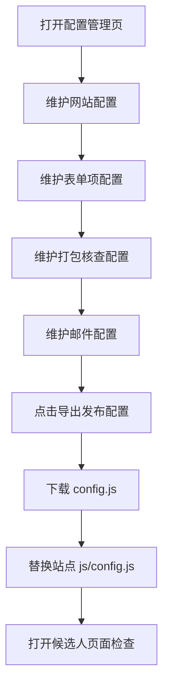
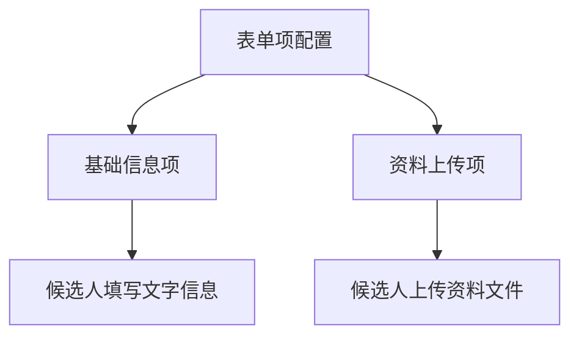
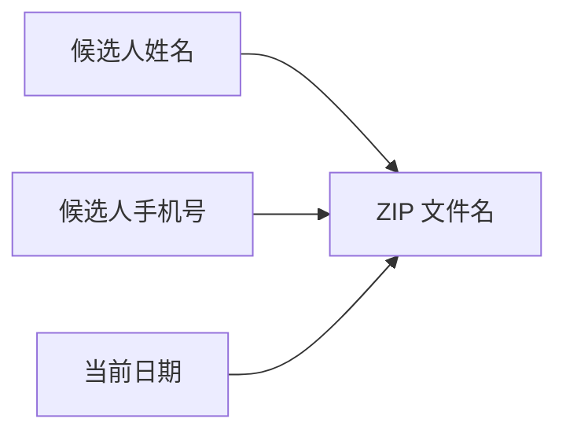
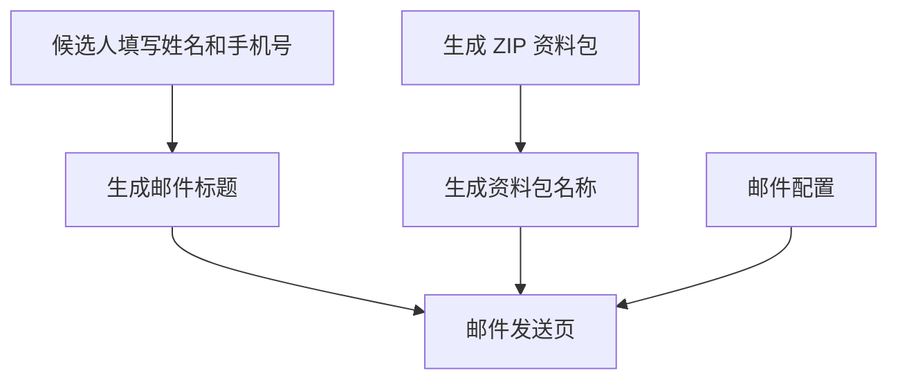

# 入职资料收集工具操作手册

| 项目   | 内容                                       |
| ---- | ---------------------------------------- |
| 文档名称 | 入职资料收集工具操作手册                             |
| 文档类型 | 业务操作手册                                   |
| 版本   | V1.0                                     |
| 适用对象 | HR、招聘运营、人事接口人、资料清单维护人员                   |
| 适用页面 | 配置管理页 `config.html`、候选人资料收集页 `index.html` |
| 配置文件 | `js/config.js`                           |

---

## 1. 总览

### 1.1 页面关系

| 页面       | 使用人         | 用途                        |
| -------- | ----------- | ------------------------- |
| 配置管理页    | HR / 业务维护人员 | 维护表单标题、资料清单、打包规则、邮件信息     |
| 候选人资料收集页 | 候选人         | 填写信息、上传资料、生成加密资料包、按提示发送邮件 |

### 1.2 配置生效规则

| 规则     | 说明                                       |
| ------ | ---------------------------------------- |
| 配置生效规则 | 页面中修改后，需要导出 `config.js`，然后将该文件发送给`开发人员`让其帮忙替换即可 |

---

## 2. 操作前准备

| 准备项  | 用途       | 示例               |
| ---- | -------- | ---------------- |
| 模板文件 | 候选人下载填写  | `xxx.docx`       |
| 示例图片 | 候选人查看示例  | `xxx.png`        |
| 收件邮箱 | 候选人发送资料包 | `hr@example.com` |

---

## 3. 标准发布流程

| 步骤   | 操作                  | 结果             |
| ---- | ------------------- | -------------- |
| 1    | 打开配置管理页             | 进入配置页面         |
| 2    | 修改各页签配置             | 当前页面展示新配置      |
| 3    | 点击“导出发布配置”          | 下载 `config.js` |
| 4    | 替换站点 `js/config.js` | 配置发布到线上        |
| 5    | 打开候选人页面检查           | 确认配置生效         |

---

## 4. 配置页面模块

| 页签     | 维护内容               | 发布后影响      |
| ------ | ------------------ | ---------- |
| 网站配置   | 表单标题、表单副标题         | 候选人引导页文案   |
| 表单项配置  | 基础信息项、资料上传项        | 候选人填写和上传内容 |
| 打包核查配置 | ZIP 文件名规则、ZIP 密码提示 | 候选人生成资料包步骤 |
| 邮件配置   | 收件人、抄送人、邮件标题、邮件正文  | 候选人邮件发送步骤  |

---

## 5. 网站配置

### 5.1 字段说明

| 字段    | 说明       | 示例                         |
| ----- | -------- | -------------------------- |
| 表单标题  | 候选人页面主标题 | 入职资料自助收集                   |
| 表单副标题 | 标题下方提示文案 | 请按照下方流程准备并填写，预计耗时 5-10 分钟。 |

### 5.2 配置管理页

### 5.2 配置影响页

---

## 6. 表单项配置

### 6.1 模块结构

| 区域    | 用途        | 常见内容          |
| ----- | --------- | ------------- |
| 基础信息项 | 候选人填写文字信息 | 姓名、手机号        |
| 资料上传项 | 候选人上传文件   | 身份证、学历证书、政审报告 |

---

### 6.2. 基础信息项配置字段说明

| 配置项  | 说明         | 建议         |
| ---- | ---------- | ---------- |
| 字段名称 | 候选人看到的字段名称 | 简短明确       |
| 必填   | 是否必须填写     | 姓名、手机号建议必填 |
| 占位提示 | 输入框提示文案    | 使用“请输入xxx” |
| 排序   | 字段显示顺序     | 数字越小越靠前    |
| 删除   | 删除该字段      | 谨慎操作       |

### 6.3. 资料上传项配置字段说明

| 配置项      | 说明          | 建议           |
| -------- | ----------- | ------------ |
| 资料项名称    | 候选人看到的资料名称  | 使用短名称        |
| 显示顺序     | 资料项显示顺序     | 从 1 开始排序     |
| 是否必填     | 是否必须上传      | 必交资料打开       |
| 允许上传类型   | 候选人可上传的文件类型 | 图片、PDF 最常用   |
| 最多上传文件数  | 单项资料最多上传数量  | 按资料复杂度设置     |
| 单文件大小 MB | 单个文件大小上限    | 默认 20MB 通常够用 |
| 模板文件名称   | 模板下载文件名     | 无模板则留空       |
| 示例图片名称   | 示例图片文件名     | 无示例则留空       |
| 资料项说明    | 候选人准备资料的要求  | 写清楚、可执行      |
| 资料项命名规则  | ZIP 内文件命名规则 | 一般保持默认       |

### 6.4 配置管理页

### 6.5 配置影响页

---

## 7. 打包核查配置

### 7.1 字段说明

| 配置项       | 说明           | 默认建议                        |
| --------- | ------------ | --------------------------- |
| ZIP 文件名规则 | 候选人下载资料包的文件名 | `{姓名}_{手机号}_入职资料包_{日期}.zip` |
| ZIP 密码提示  | 候选人输入密码时的提示  | 提醒密码由 HR 约定                 |

### 7.2 ZIP 文件名生成逻辑

### 7.3 配置管理页

### 7.4 配置影响页

---

## 8. 邮件配置

### 8.1 字段说明

| 配置项    | 说明             | 示例                            |
| ------ | -------------- | ----------------------------- |
| 收件邮箱   | HR 接收资料包的邮箱    | `hr@example.com`              |
| 抄送邮箱   | 可选，多个邮箱用英文逗号分隔 | `a@example.com,b@example.com` |
| 邮件标题模板 | 候选人邮件标题        | `【入职资料】{姓名}-{手机号}`            |
| 邮件正文模板 | 候选人邮件正文        | 按公司要求填写                       |

### 8.2 邮件发送信息生成逻辑

### 8.3 可用变量

| 变量        | 含义          |
| --------- | ----------- |
| `{姓名}`    | 候选人填写的姓名    |
| `{手机号}`   | 候选人填写的手机号   |
| `{日期}`    | 当前日期        |
| `{时间}`    | 当前时间        |
| `{表单标题}`  | 网站配置中的表单标题  |
| `{压缩包名称}` | 生成的 ZIP 文件名 |
| `{附件编号}`  | 资料项编号       |
| `{资料名称}`  | 资料项名称       |
| `{序号}`    | 文件序号        |
| `{扩展名}`   | 文件后缀        |

### 8.4 配置管理页

### 8.5 配置影响页

---

## 9. 一句话流程

